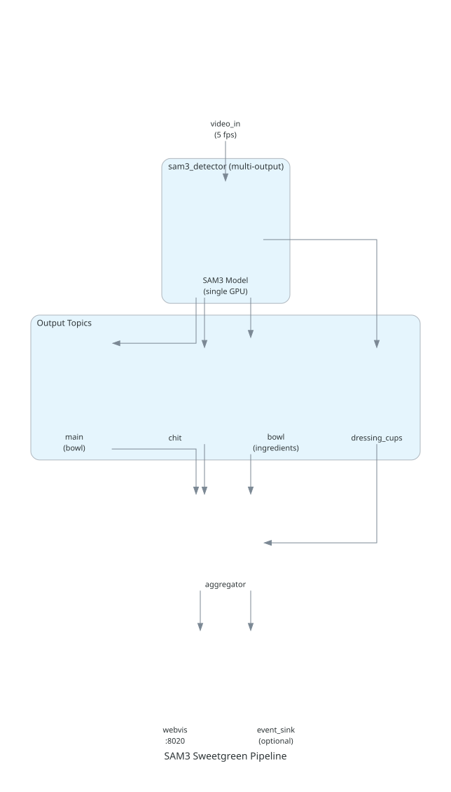

# Sweetgreen Integration

SAM3 detector integration with the Sweetgreen pipeline. A single SAM3 instance replaces 4 production detectors using multi-output mode.



## Quick Start

```bash
# 1. Authenticate with GAR
gcloud auth configure-docker us-west1-docker.pkg.dev

# 2. Get test video
gsutil cp gs://protege-artifacts-production/customer-sweetgreen/Shared-Videos/TestVideo-2025-11-18.mp4 data/input.mp4
ffmpeg -ss 00:01:01 -t 00:02:00 -i data/input.mp4 -c copy data/sample-video.mp4

# 3. Run pipeline (uses 0.2.0-dev from GAR by default)
docker compose -f sweetgreen.yaml up --abort-on-container-exit

# 4. View results
open http://localhost:8020
cat output/detections.jsonl | jq .
```

## What SAM3 Replaces

| Production Filter | SAM3 Prompt Set | Topic |
|-------------------|-----------------|-------|
| `filter-bowl-detector` | bowl | main |
| `filter-chit-detector` | chit | chit |
| `filter_protege_bowl` | avocado, chicken, steak, egg, tofu, portobello | bowl |
| `filter_protege_dressing_cups` | dressing_cup | dressing_cups |

## Local Development

```bash
# Build local image (requires HF token for SAM3 model)
HF_TOKEN=$(gcloud secrets versions access latest --secret=sam3-hf-token --project=plainsightai-dev) \
  docker build --secret id=hf_token,env=HF_TOKEN -t filter-sam3-detector:local .

# Run with local image
SAM3_IMAGE=filter-sam3-detector:local docker compose -f sweetgreen.yaml up --abort-on-container-exit
```

## Production Mode

```bash
# With event sink
FILTER_API_ENDPOINT="https://api.prod.plainsight.tech/filter-pipelines/sweetgreen-<location>/events?project=<project-id>" \
FILTER_API_TOKEN="<token>" \
  docker compose -f sweetgreen.yaml --profile event-sink up
```

## Output Format

```json
{
  "filter_name": "SAM3IngredientClassifier",
  "topic": "bowl",
  "data": {
    "id": 42,
    "meta": {
      "detections": [{"class": "chicken", "rois": [[642, 1178, 739, 1259]]}],
      "classification": {"classes": ["chicken"], "confidences": [0.68], "architecture": "sam3"},
      "frame_id": 42
    }
  }
}
```

## Troubleshooting

```bash
# GPU not available
docker run --rm --gpus all nvidia/cuda:11.8-base-ubuntu22.04 nvidia-smi

# Check aggregator receiving data
docker compose -f sweetgreen.yaml logs filter_sweet_green_subject_data_aggregator | grep "incoming bundle keys"
```
